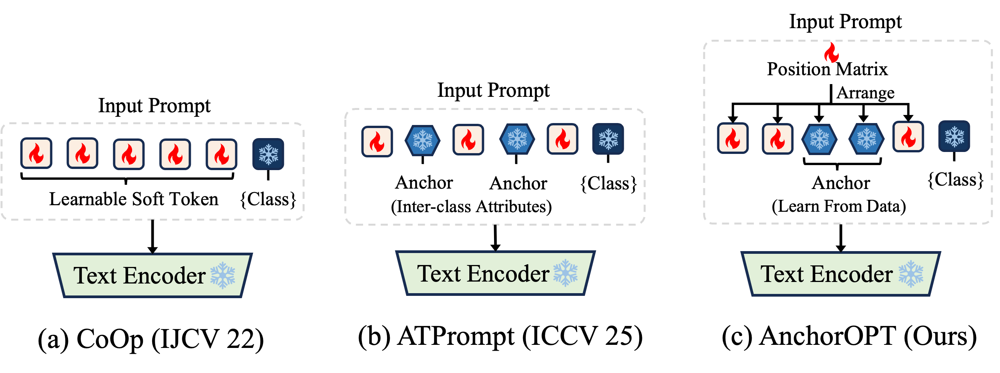

<!-- <div align="center">
<h1>Advancing Textual Prompt Learning with Anchored Attributes</h1>
  
[**Zheng Li**](https://zhengli97.github.io)<sup>1</sup> · [**Yibing Song**](https://ybsong00.github.io/)<sup>2</sup> · [**Ming-Ming Cheng**](https://mmcheng.net/)<sup>1</sup> · [**Xiang Li**](https://implus.github.io/)<sup>1</sup> · [**Jian Yang**](https://scholar.google.com/citations?user=6CIDtZQAAAAJ&hl=en)<sup>1</sup>

<sup>1</sup>Nankai University,
<sup>2</sup>Damo Academy, Alibaba Group -->


<!-- **ICCV 2025**

**[[Paper](https://arxiv.org/abs/2412.09442)] [[Project Page](https://zhengli97.github.io/ATPrompt/)] [[Poster](https://github.com/zhengli97/ATPrompt/blob/main/docs/ATPrompt_poster.pdf)] [[PPT](https://github.com/zhengli97/ATPrompt/blob/main/docs/ATPrompt_ppt.pdf)] [[中文解读](https://zhuanlan.zhihu.com/p/11787739769)] [[中文翻译](https://github.com/zhengli97/ATPrompt/blob/main/docs/ATPrompt_chinese_version.pdf)]**

</div> -->

<!-- <hr/> -->

<!-- 
## 🔥 News
- 2025.07. The open source process of this paper is not yet complete. Detailed hyperparameter list, pre-trained model weights, and training logs will be provided soon.
- 2025.06. ATPrompt was accepted by ICCV 2025. See you in Hawaii! Video demonstration is coming soon!
- 2024.12. We release the official code of ATPrompt and create the project page. The Chinese interpretation of the paper is now available on the [Zhihu forum](https://zhuanlan.zhihu.com/p/11787739769). -->

# Anchor Token Guided Prompt Learning Methods for VLMs.

This repo contains a series of anchor token-guided prompt learning methods for Vision-Language Models (CLIP):

- **[Arxiv] AnchorOPT: Towards Optimizing Dynamic Anchors for Adaptive Prompt Learning.**    
Zheng Li, Yibing Song, Xin Zhang, Lei Luo, Xiang Li, Jian Yang.    
[[Paper]()]

- **[ICCV 25] Advancing Textual Prompt Learning with Anchored Attributes.**    
Zheng Li, Yibing Song, Ming-Ming Cheng, Xiang Li, Jian Yang.   
[[Paper](https://arxiv.org/abs/2412.09442)] [[Project Page](https://zhengli97.github.io/ATPrompt/)] [[Poster](https://github.com/zhengli97/ATPrompt/blob/main/docs/ATPrompt_poster.pdf)] [[PPT](https://github.com/zhengli97/ATPrompt/blob/main/docs/ATPrompt_ppt.pdf)] [[中文解读](https://zhuanlan.zhihu.com/p/11787739769)] [[中文翻译](https://github.com/zhengli97/ATPrompt/blob/main/docs/ATPrompt_chinese_version.pdf)]


## 💡 Helpful Resources:

- If you are interested in prompt learning and want to know more about related work, we also maintain [a list of awesome papers](https://github.com/zhengli97/Awesome-Prompt-Adapter-Learning-for-Vision-Language-Models) for your reference.
- If you attempt to reproduce the results of this implementation on the existing 15 datasets, the links to those datasets may be broken and unusable. For your convenience, we have provided 14 datasets (excluding ImageNet) in the HuggingFace platform. [[Download_Links](https://huggingface.co/zhengli97/prompt_learning_dataset)]

## 🔥 Some other works may interest you:

- **[CVPR 24] PromptKD: Unsupervised Prompt Distillation for Vision-Language Models**   
Zheng Li, Xiang Li, Xinyi Fu, Xin Zhang, Weiqiang Wang, Shuo Chen, Jian Yang.   
[[Paper](https://arxiv.org/abs/2403.02781)] [[Code](https://github.com/zhengli97/PromptKD)] [[Project Page](https://zhengli97.github.io/PromptKD)] [[Poster](https://github.com/zhengli97/PromptKD/blob/main/images/promptkd_poster.pdf)] [[中文论文解读](https://zhuanlan.zhihu.com/p/684269963)] [[视频解读](https://www.techbeat.net/talk-info?id=915)] [[中文翻译](https://github.com/zhengli97/PromptKD/blob/main/docs/PromptKD_chinese_version.pdf)].  
PromptKD is a simple and effective prompt-driven unsupervised distillation framework for VLMs (e.g., CLIP), with state-of-the-art performance.

## 🧪 Experimental Comparison


| Methods    | Paper    | Pub      | Base   | Novel  | HM (main) | Code | Type |
| :---:      | :---:    | :---:    | ---    | ---    | :---:     | :--: | :--: |
| CLIP       | [Link](https://arxiv.org/abs/2103.00020) | ICML 21 | 69.34 | 74.22 | 71.70 | [Link](https://github.com/openai/CLIP)  | Model |
| CoOp       | [Link](https://arxiv.org/abs/2203.05557) | IJCV 22 | 82.69 | 63.22 | 71.66 | [Link](https://github.com/kaiyangzhou/coop)  | Baseline |
| +ATPrompt   | - | ICCV 25 | 82.68 | 68.04 | **74.65(+2.99)** | - | Plugin |
| +AnchorOPT  | - | Arxiv   | 81.24 | 76.27 | **78.68(+7.02)** | - | Plugin |
| CoCoOp     | [Link](https://arxiv.org/abs/2203.05557) | CVPR 22 | 80.47 | 71.69 | 75.83 | [Link](https://github.com/KaiyangZhou/CoOp)  | Baseline |
| +ATPrompt  | - | ICCV 25 | 81.69 | 74.54 | **77.95(+2.21)** | - | Plugin |
| +AnchorOPT | - | Arxiv   | 81.87 | 77.06 | **79.39(+3.56)** | - | Plugin |
| MaPLe      | [Link](https://arxiv.org/abs/2210.03117) | CVPR 23 | 82.28 | 75.14 | 78.55 | [Link](https://github.com/muzairkhattak/multimodal-prompt-learning) | Baseline |
| +ATPrompt  | - | ICCV 25 | 82.98 | 75.76 | **79.21(+0.66)** | - | Plugin |
| +AnchorOPT | - | Arxiv   | 83.62 | 77.36 | **80.37(+1.82)** | - | Plugin |
| DePT       | [Link](https://arxiv.org/abs/2309.07439) | CVPR 24 | 83.80 | 72.89 | 77.97 | [Link](https://github.com/Koorye/DePT) | Baseline |
| +ATPrompt  | - | ICCV 25 | 83.80 | 73.75 | **78.45(+1.16)** | - | Plugin |
| +AnchorOPT | - | Arxiv   | 84.27 | 76.90 | **80.42(+3.13)** | - | Plugin |


## 🗒 [Arxiv] AnchorOPT: Towards Optimizing Dynamic Anchors for Adaptive Prompt Learning.

### Abstract

Existing prompt learning methods, which are built upon CLIP models, leverage textual tokens as anchors to guide the learnable soft tokens. This guidance improves CLIP generalizations. However, these anchors—static in both value and position—lack cross-task and stage-adaptive flexibility. 

To address this limitation, we propose AnchorOPT, a dynamic anchor-based prompt learning framework. Specifically, AnchorOPT introduces dynamism in two key dimensions: (i) anchor values eschew handcrafted explicit textual tokens (e.g., "shape", "color"), instead learning dynamically from task-specific data; and (ii) the positional relationship between anchor and soft tokens is no longer fixed but adaptively optimized via a learnable position matrix conditioned on the training stage and task context. 

Training occurs in two stages: we first learn the anchor tokens, then freeze and transfer them to the second stage for optimization of soft tokens and the position matrix.

### Framework

<div style="text-align:center"></div>
<figcaption class="content has-text-left"  style="word-break:normal">Fig 1. Architectural comparison among classic prompt learning, ATPrompt, and our proposed AnchorOPT. </figcaption>

### 🚀 Running

Please see the [[AnchorOPT Reproduction Guide](docs/AnchorOPT.md)].


## 🗒 [ICCV 25] ATPrompt: Advancing Textual Prompt Learning with Anchored Attributes

### Abstract

In this work, we introduce an attribute-anchored textual prompt learning method for vision-language models, named ATPrompt.

This method extends the learning space of soft prompts from the original one-dimensional category level to the multi-dimensional attribute level by incorporating multiple universal attribute tokens into the learnable soft prompts. 

Guided by these attributes, soft tokens acquire not only category-specific but also attribute-related general representations during training, thereby enhancing the alignment between images and unknown categories compared to the original method.


### Framework

<div style="text-align:center"></div>
<figcaption class="content has-text-left"  style="word-break:normal">Fig 2. Architectural comparison among vanilla CLIP, classic prompt learning, and our proposed attribute-anchored prompt learning. </figcaption>


### 🚀 Running

Please see the [[ATPrompt Reproduction Guide](docs/ATPrompt.md)].

## ✉️ Contact

If you have any questions, you can submit an [issue](https://github.com/zhengli97/ATPrompt/issues) on GitHub, or contact me by email (zhengli97[at]foxmail.com).

## ⭐ Citation

If you find our paper or repo helpful for your research, please consider citing the following paper and giving this repo a star. Thank you!

```
@inproceedings{li2025advancing,
  title={Advancing textual prompt learning with anchored attributes},
  author={Li, Zheng and Song, Yibing and Cheng, Ming-Ming and Li, Xiang and Yang, Jian},
  booktitle={Proceedings of the IEEE/CVF International Conference on Computer Vision},
  pages={3618--3627},
  year={2025}
}

@inproceedings{li2024promptkd,
  title={Promptkd: Unsupervised prompt distillation for vision-language models},
  author={Li, Zheng and Li, Xiang and Fu, Xinyi and Zhang, Xin and Wang, Weiqiang and Chen, Shuo and Yang, Jian},
  booktitle={Proceedings of the IEEE/CVF Conference on Computer Vision and Pattern Recognition},
  pages={26617--26626},
  year={2024}
}
```

