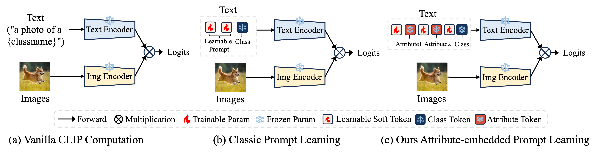
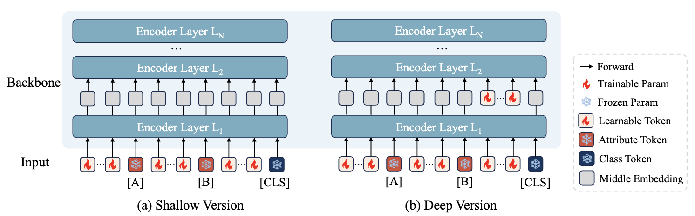
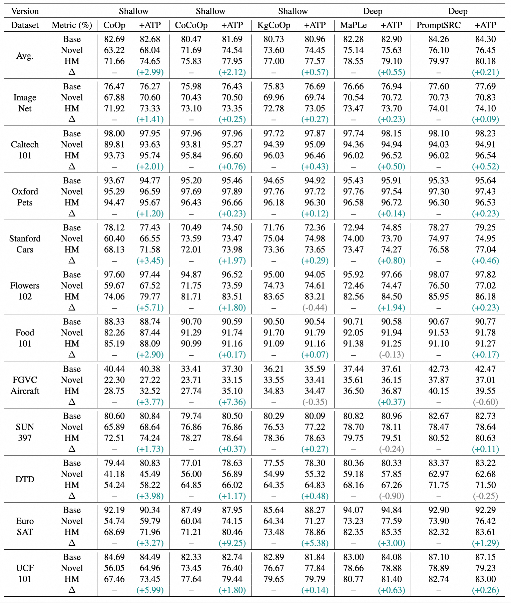
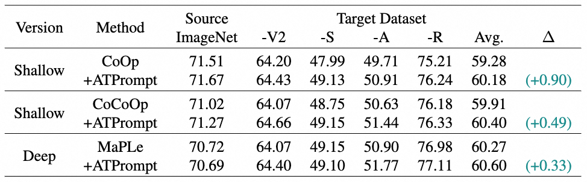

# ATPrompt: Textual Prompt Learning with Embedded Attributes


> [**PromptKD: Unsupervised Prompt Distillation for Vision-Language Models**]() <br>
> Zheng Li, Yibing Song, Penghai Zhao, Ming-Ming Cheng, Xiang Li#, Jian Yang#. <br>
> Nankai University, Alibaba DAMO Academy. <br>
> [[Paper]()] [[Project Page(TBD)]()] [[Paper Interpretation(TBD)]()] [[中文解读(TBD)]()]

<hr/>

### Abstract

In this work, we introduce an attribute-embedded textual prompt learning method for vision-language models, named ATPrompt.

This method extends the learning space of soft prompts from the original
one-dimensional category level to the multi-dimensional at-
tribute level by embedding multiple fixed universal attribute
tokens into the learnable soft prompts. 

Guided by these attributes, soft prompts acquire not only category-specific but also attribute-related general representations during training, thereby enhancing the alignment between images and unknown categories compared to the original method

### Framework

<div style="text-align:center"></div>
<figcaption class="content has-text-left"  style="word-break:normal">Figure 1. Architectural comparison among vanilla CLIP, classic prompt learning, and our proposed attribute-embedded prompt learning. </figcaption>

<br>

<div style="text-align:center"></div>
<figcaption class="content has-text-left"  style="word-break:normal">Figure 2. An illustration of the computation process for shallow and deep versions.  </figcaption>


### Highlights

(1). We introduce an attribute-templated prompt learning method for VLMs that utilizes universal attributes to regularize the learning of soft prompts.

(2). We introduce a differentiable attribute search method that learns to determine the appropriate attribute content and quantity.

(3). Both shallow and deep versions of ATprompt are introduced to achieve compatibility with existing methods.

(4). ATPrompt can be seamlessly intergrated into existing textual-based methods and brings general improvement at a negligible computational cost.

## Experimental Results

The results are averaged over 3 seeds. Note that due to the limited number of training samples and network parameters, the performance results may fluctuate. If you cannot achieve the reported results, please run more experiments with different seeds.

### Base-to-Novel Generalization

<details>
<summary>Click to expand "Result Figures".</Summary>
<figure>
    
<figcaption class="content has-text-left" style="word-break:normal">Table 1: Base-to-novel generalization experiments of five baselines with and without our ATPrompt on 11 recognition datasets. HM: Harmonic Mean. ∆: HM improvement of ATPrompt over previous results. "ATPrompt" is abbreviated as "ATP". Our method achieves consistent average performance improvement over different baselines.
</figure>
</details>

### Cross-dataset Experiments

<details>
<summary>Click to expand "Result Figures".</Summary>
<figure>
   
<figcaption class="content has-text-left" style="word-break:normal">Table 2: Cross-dataset generalization experiments of three baselines with and without our ATPrompt on 11 datasets. Our method achieves consistent average performance improvements over three baseline methods.
</figure>
</details>

### Domain Generalization

<details>
<summary>Click to expand "Result Figures".</Summary>
<figure>
   
<figcaption class="content has-text-left" style="word-break:normal">Table 3: Domain generalization experiments of three baselines with and without our ATPrompt on 4 datasets. Our method achieves consistent average performance improvement over three baseline methods.
</figure>
</details>

## Running

### Preliminary

1. Create the environment and install Dassl.pytorch library. Please follow the instruction detailed in [INSTALL.md](docs/INSTALL.md).

2. Prepare the dataset. Please follow the instructions detailed in [DATASETS.md](docs/DATASETS.md). If you are unable to access the StanfordCars dataset, we have provided the dataset in [[GitHub Release]((https://github.com/zhengli97/PromptKD/releases/tag/datasets))] for your convenience.

3. (Optional) Download the original ViT-B/16 and ViT-L/14 CLIP model weights from the official OpenAI website. Then place these models in the `./clip` folder. Comment the `trainers/coop.py line 42` and uncomment the `line 43`.  
[[ViT-B/16 CLIP](https://openaipublic.azureedge.net/clip/models/5806e77cd80f8b59890b7e101eabd078d9fb84e6937f9e85e4ecb61988df416f/ViT-B-16.pt)] [[ViT-L/14 CLIP](https://openaipublic.azureedge.net/clip/models/b8cca3fd41ae0c99ba7e8951adf17d267cdb84cd88be6f7c2e0eca1737a03836/ViT-L-14.pt)]

### Running ATPrompt

#### Step I: Attribute Search (Two Options)

(1) Directly use our results.

Here we provide the five attribute bases obtained by querying the LLM (GPT-4o) and the final result after the differentiable attribute search. You can directly use our results for subsequent training.

Expand the list below👇 to see the results:
<details>
<summary>Click to expand "Attribute Lists"</Summary>

| Dataset | Attribute Bases | Searched Results |
|:---------------:|:---------------:|:-----------------:|
| ImageNet-1K   | color, size, shape, habitat, behavior                  | (color, shape) |
| Caltech101    | shape, color, material, function, size                 | (shape,size) |
| Oxford Pets   | loyalty, affection, playfulness, energy, intelligence  | (playfulness, energy) |
| Stanford Cars | design, engine, performance, luxury, color             | (luxury) |
| Flowers-102   | color, flower, habitat, growth, season                 | (color, habitat, growth) |
| Food-101      | flavor, texture, origin, ingredients, preparation      | (flavor, preparation) |
| FGVC Aircraft | design, capacity, range, engines, liveries             | (design, range) |
| SUN-397       | architecture, environment, structure, design, function | (function) |
| DTD           | pattern, texture, color, design, structure             | (pattern, color, design) |
| EuroSAT       | habitat, foliage, infrastructure, terrain, watercourse | (habitat) |
| UCF-101       | precision, coordination, technique, strength, control  | (precision) |

Table 1. Attribute bases and searched results for each dataset.
</details>

(2) Reproduce the whole process on your own.

- Register a ChatGPT service account (We are using [ZhiZengZeng](https://gpt.zhizengzeng.com/#/)) and enter the API Key in `gpt_query.py line 27`. Then run the following code:   
```bash
python gpt_query.py
```    
In this way, you will get five output attributes after running the code.    
(You can change the input prompt in `gpt_query.py line 94` to specify as many attributes as you want.)   

- Enter the five attributes into the variables `ATT1_TEXT`, `ATT2_TEXT`, `ATT3_TEXT`, `ATT4_TEXT` and `ATT5_TEXT` in `scripts/attribute_compute/main.sh`. Then run the attribute search code:
```bash
sh scripts/attribute_compute/main.sh
```
Select the result with the **highest confidence** in the last epoch as our target attribute.

In the following part, we provide the complete training log on Caltech101 for your reference.

#### Step II: Prompt Learning with ATPrompt.

Here we take the **CoOp+ATPrompt** method as an example. You can switch to other baseline methods if you want.

(1) Base-to-Novel Experiments.

1. The config files for each baseline method are provided in `configs/trainers/`. You can modify the hyper-parameters in these config files.

2. Change the `DATA` in `scripts/coop/base2new_train.sh line 4` to your current dataset path.

3. Run the following commands to train the model using the ATPrompt method:   

**Training:**
```bash
# CoOp+ATPrompt, dataset=imagenet
sh scripts/coop/atp_base2new_train.sh imagenet

# CoOp+ATPrompt, dataset=caltech101
sh scripts/coop/atp_base2new_train.sh caltech101
```
**Testing:**
```bash
# CoOp+ATPrompt, dataset=caltech101
sh scripts/coop/atp_base2new_test.sh caltech101
```

If you don't want to use ATPrompt, you can set `TRAINER.ATPROMPT.USE_ATPROMPT` in `scripts/coop/base2new_train.sh line 31` to **False**.   
Or you can run the following command:

```bash
# Vanilla CoOp
sh scripts/coop/vanilla_base2new_train.sh imagenet
```

For more details, please refer to `docs/`.

(2) Cross-dataset & Domain Generalization Experiments.

1. Change the `DATA` in `scripts/coop/xd_train.sh line 4` to your current dataset path.

2. Train the model on the source dataset (ImageNet) and select the best performing model.

```bash
sh scripts/coop/xd_train.sh
```

3. After training, evaluate the model on other recognition dataset. For example, the modal trained with **seed 1** has the best performance.

```bash
# Cross-dataset
# dataset=caltech101, seed=1
sh scripts/coop/xd_eval.sh caltech101 1

# Domain Generalization
# dataset=imagenet_a, seed=1
sh scripts/coop/xd_eval.sh imagenet_a 1
```

In the following part, we provide the complete training log and model weights of **CoOp+ATPrompt** for your reference.


## Training Logs & Weights

- Attribute Search.  
We provide the complete attribute searching log on the Caltech101 dataset for your reference.   
[[Baidu Cloud(TBD)]()] [[TeraBox(TBD)]()] [[Github Releases(TBD)]()]

- Prompt Learning (CoOp+ATPrompt).  
We provide model weights and training logs trained on the source dataset (ImageNet) under cross-dataset setings.  
[[Baidu Cloud(TBD)]()] [[TeraBox(TBD)]()] [[Github Releases(TBD)]()]


## Contact

If you have any questions, you can submit an [issue](https://github.com/zhengli97/ATPrompt/issues) on GitHub, or contact me by email (zhengli97 [at] qq.com).

## Acknowledgements

Our code is based on [PromptSRC](https://github.com/muzairkhattak/PromptSRC), [MaPLe](https://github.com/muzairkhattak/multimodal-prompt-learning), [KgCoOp](https://github.com/htyao89/KgCoOp), [Co-CoOp and CoOp](https://github.com/KaiyangZhou/CoOp) repository. We thank the authors for releasing their code.


